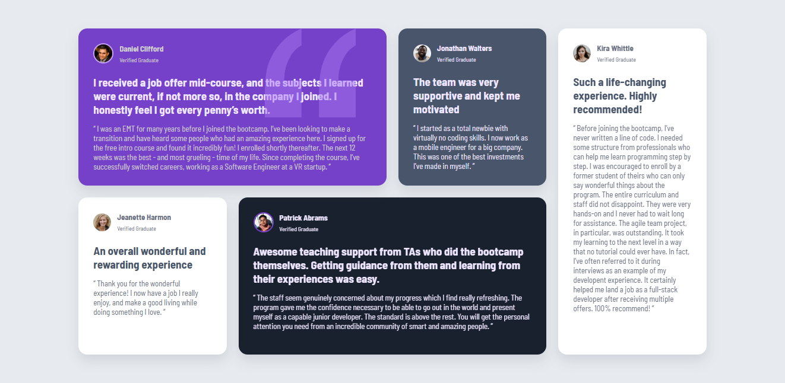
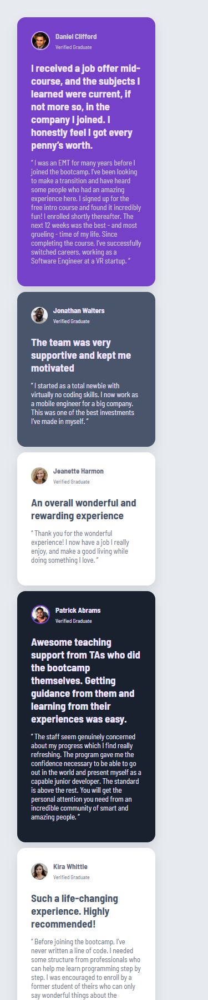

## Testimonials Grid Section | Frontend Mentor Challenge

Thanks for checking out this front-end coding challenge.

This is a solution for [Frontend Mentor challenge](https://www.frontendmentor.io/challenges/testimonials-grid-section-Nnw6J7Un7) to learn the basics about HTML and CSS.

## Table of contents!
- [Overview](#overview)
  - [Screenshot](#screenshot)
  - [Links](#links)
- [My process](#my-process)
  - [Built with](#built-with)
  - [What I learned](#what-i-learned-building-this-project)

## Overview

This project is a solution to the Testimonials grid section challenge on Frontend Mentor. The goal was to replicate the provided design using HTML and CSS only, focusing on layout precision and clean structure.

## Screenshot

## Links

- [Live Site](https://gregorioveraza.github.io/Testimonial-grid-section-main)
- [Repository](https://github.com/GregorioVeraza/Testimonial-grid-section-main)

## My process

## Built with
- HTML
- CSS Grid
- CSS flexbox

## What I learned building this project

During this project, I learned to be more confident with:

- How to use **CSS grid** to make a responsive design with media queries.
- How to use properties like border, margin, padding, box-sizing
- How to use selectors
- How I can use **CSS grid** and **flex** together, and how powerful
it can be in some cases